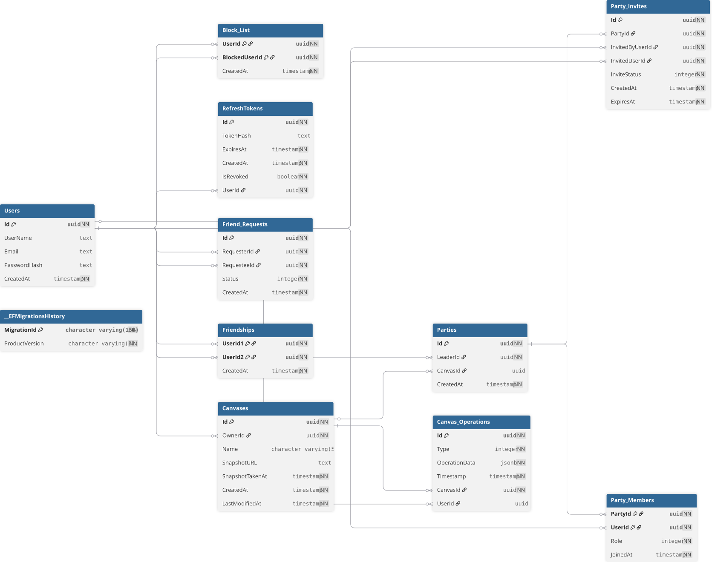

# Inkboard

Simple real-time canvas for shared drawing.

[About](#about) · [Preview](#preview) · [Schema](#schema) · [Setup](#setup) · [Docs](#docs)

## About

Inkboard is a shared drawing app made for quick live collaboration. It is inspired by simple sketching tools like MS Paint and by party-style group rooms, so it stays easy to use while still feeling social.

## What It Does

- Lets multiple people draw on the same canvas at the same time.
- Shows updates in real time.
- Keeps drawing simple, fast, and easy to follow.

## Main Features

- Shared live canvas for group drawing.
- Simple room-based sessions for friends or teammates.
- Fast feedback while you draw.
- Clean browser-based experience.

## Preview

### Demo Video

https://github.com/user-attachments/assets/9f100f4d-8ae1-4a37-ac01-8cd2d7037b84

## Schema

This diagram shows the database schema used by the app, if you prefer to inspect it closer, you can download
the *pg_dump* at [schema.sql](/docs/Database/schema.sql) and import it into [dbdiagram.io](https://dbdiagram.io) for PostgreSQL. Another alternative is using running the database migration on a local db and dumping it yourself.

  

## Setup

### Client

1. Go to `client/`.
2. Run `pnpm install`.
3. Run `pnpm run dev`.

### Server

1. Go to `server/`.
2. Run `dotnet restore`.
3. Run `dotnet run --project Inkboard.API`.

## Docs

If you want more detail, start with [ARCHITECTURE.md](/docs/ARCHITECTURE.md).

## Notes

The project is still growing, so small changes may happen over time.

# Contributing

If you're interested in making contributions, check [TODO.md](/TODO.md)