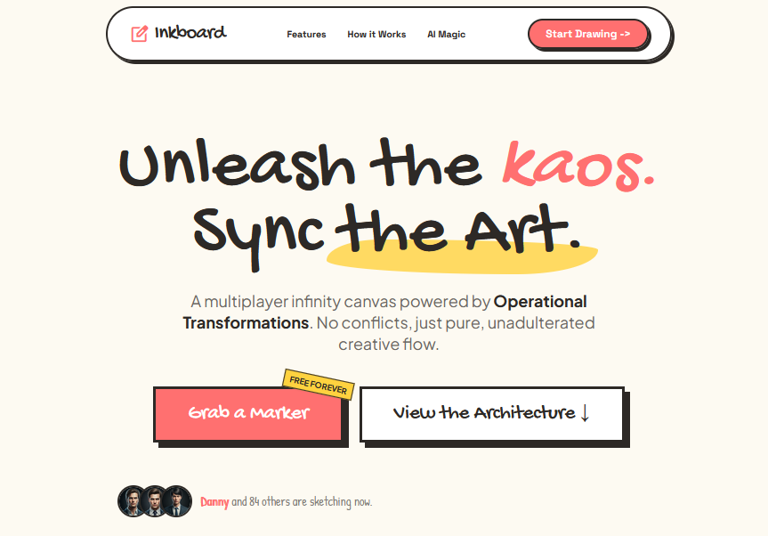
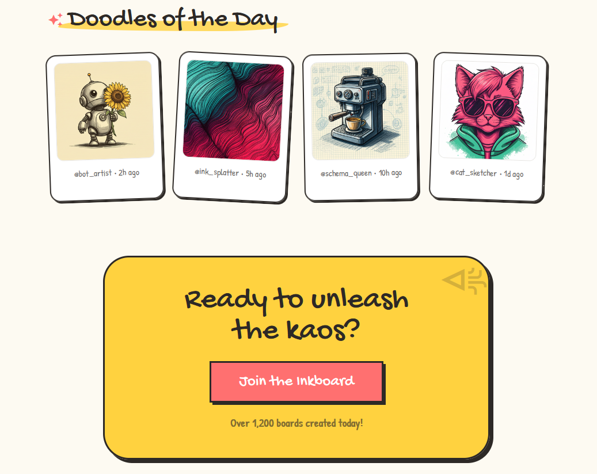

# Inkboard

[About](#about) · [Preview](#preview) · [Schema](#schema) · [Setup](#setup) · [Docs](#docs)

Simple real-time canvas for shared drawing.

## About

Inkboard is a shared drawing app made for quick live collaboration. It is inspired by simple sketching tools like MS Paint and by party-style group rooms, so it stays easy to use while still feeling social.

## What It Does

- Lets multiple people draw on the same canvas at the same time.
- Shows updates in real time.
- Keeps drawing simple, fast, and easy to follow.

## Main Features

- Shared live canvas for group drawing.
- Simple room-based sessions for friends or teammates.
- Fast feedback while you draw.
- Clean browser-based experience.

## Preview

### Landing Page

  

### Doodles Page

  

## Schema

This diagram shows the database schema used by the app.

  

## Setup

### Client

1. Go to `client/`.
2. Run `npm install`.
3. Run `npm run dev`.

### Server

1. Go to `server/`.
2. Run `dotnet restore`.
3. Run `dotnet run --project Inkboard.API`.

## Docs

If you want more detail, start with [ARCHITECTURE.md](/home/jymeng18/Projects/Inkboard/docs/ARCHITECTURE.md).

## Notes

The project is still growing, so small changes may happen over time.